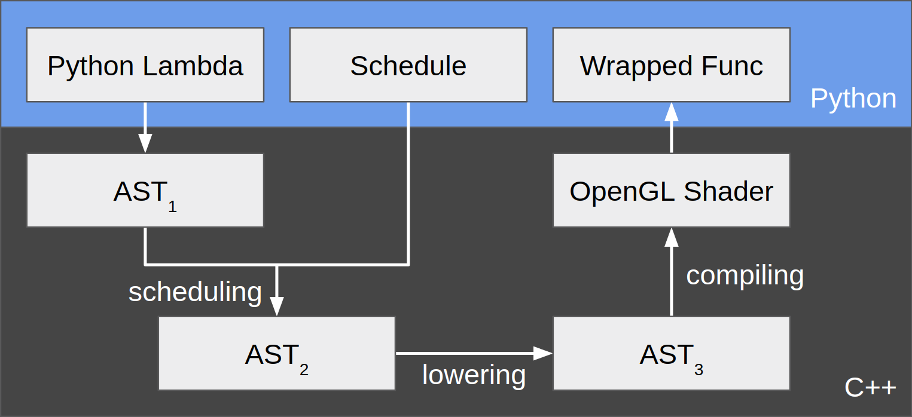
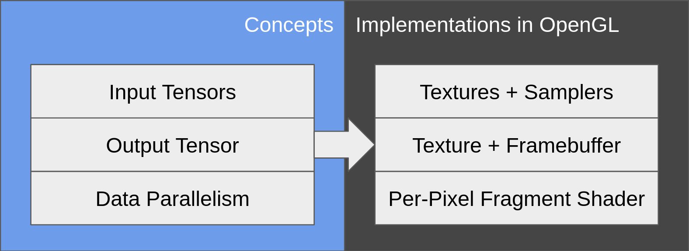

## [Report WIP] 15-418/618 <br/>Parallel Computer Architecture and Programming <br/>Final Project<br/>Compile Python into GLSL - OpenGL Backend for MXNet/TVM

### Zhixun Tan (zhixunt), Peng Wang (pwang1)

TVM part: [https://github.com/dmlc/tvm/pull/672](https://github.com/dmlc/tvm/pull/672)

Optimization exploration part: [https://github.com/stomakun/Glitter](https://github.com/stomakun/Glitter)

### Summary

In this project, we

1) Added an OpenGL backend for MXNet/TVM - a general-purpose tensor computation framework, so that it automatically transforms a (limited subset of) Python program into an OpenGL shader that runs on the GPU.

2) Explored optimizations of OpenGL shader programs so that a typical computation task needed in machine learning - matrix multiplication - runs <TODO: how many times?>x faster on GPU than on CPU.

### Background: MXNet and TVM

[MXNet](https://github.com/apache/incubator-mxnet) is an open-source deep learning framework, similar to [TensorFlow](https://github.com/tensorflow/tensorflow), [Caffe](https://github.com/caffe2/caffe2), [CNTK](https://github.com/Microsoft/CNTK), etc. The programmer specifies a high-level **computation graph**, and MXNet utilizes a data-flow runtime scheduler to execute the graph in a parallel / distributed setting, depending on the available computation resources. MXNet supports running deep learning algorithms in various environments: CPUs, GPUs, or even mobile devices.

An active project within MXNet is [TVM](https://github.com/dmlc/tvm), an **intermediate representation** for tensor computation. After the user uses MXNet (or other frameworks that TVM intends to support) to create a machine learning program, the computation graph is transformed into a lower-level but still cross-platform representation in TVM. Then, TVM supports further transformations into platform-specific code: CUDA, OpenCL, etc. In other words, TVM is considered the LLVM for deep learning.

### Part 1: OpenGL Backend for TVM

In our project, we added **a new backend platform for TVM: OpenGL**. More specifically, we made TVM able to generate OpenGL shading language (GLSL) kernels to perform tensor computation on the GPU.

#### Why OpenGL when we have CUDA?

A natural question is why we want to use OpenGL instead of CUDA (or OpenCL) to perform computation on the GPU.

While it is true that we can (and should) use CUDA to write GPGPU programs, our end goal is actually running them in a browser. Currently, **WebGL** is supported by [all the main-stream browsers](https://caniuse.com/#feat=webgl2), but neither OpenCL nor CUDA is supported by them. Therefore, if we want to utilize a GPU from the browser, we still need to go back to the dark pre-CUDA age.

Most browsers support WebGL with GLSL (OpenGL Shading Language) v3, which does not have the "compute shader", i.e. CUDA-like computation kernel. We still need to utilize the traditional graphics pipeline (with a vertex shader and a fragment shader).

### The TVM OpenGL Backend

#### A Concrete Example

Before diving into how it works, let's show the TVM OpenGL backend through a concrete example. The explanation is within the comments.

```python
from __future__ import absolute_import, print_function
import tvm
import numpy as np

# Step 1. Create a tensor program in Python.
# Here we are doing a matrix addition. We use a lambda to specify how
# to compute each element of the result matrix. TVM translates this
# into an internal abstract syntax tree (AST).
n = tvm.var("n")
A = tvm.placeholder((n, n), name='A')
B = tvm.placeholder((n, n), name='B')
C = tvm.compute(A.shape, lambda i, j: A[i, j] + B[i, j], name="C")

# Step 2. Create a TVM "schedule" for the program.
# A schedule specifies how to perform loops. For example, in a CUDA
# program, you might want to re-arrange loops so that the arrays are
# visited by blocks. Here we use our default "opengl" schedule which
# maps each output element to a "pixel".
s = tvm.create_schedule(C.op)
s[C].opengl()

# Step 3. "Compile" the program according to the schedule.
# This step translates the program as well as the schedule into a
# piece of GLSL. The "compiled" code is cleanly wrapped around so
# that we are left with a normal Python function.
fadd_gl = tvm.build(s, [A, B, C], "opengl", name="myadd")

# Step 4. Set up the inputs.
ctx = tvm.opengl(0)
n = 10
a = tvm.nd.array(np.random.uniform(size=(n, n)).astype(A.dtype), ctx)
b = tvm.nd.array(np.random.uniform(size=(n, n)).astype(B.dtype), ctx)
c = tvm.nd.array(np.zeros((n, n), dtype=C.dtype), ctx)

# Step 5. Run the compiled program within Python.
# To execute the program, the TVM OpenGL runtime system automatically
# - transforms the input matrices into OpenGL textures
# - sets up a framebuffer to render to
# - launch the GLSL by rendering a square that covers the "screen"
# - transforms the output matrix back from OpenGL
fadd_gl(a, b, c)

# Make sure this program is correct.
np.testing.assert_allclose(c.asnumpy(), a.asnumpy() + b.asnumpy())
```

The "compiled" GLSL program for the above example is as follows.

```glsl
#version 330 core
uniform sampler2D A;
uniform sampler2D B;
out float C;
void main() {
  ivec2 threadIdx = ivec2(gl_FragCoord.xy);
  C = (texelFetch(A, ivec2(threadIdx.x, 0), 0).r + texelFetch(B, ivec2(threadIdx.x, 0), 0).r);
}
```

#### The Architecture

Now let's dive in the architecture of TVM and how the OpenGL backend works. Figure 1 shows the overall flow that corresponds to the previous example.

<center>
<br/>
Figure 1. The Overall Flow of TVM + OpenGL
</center>

The user starts by writing a tensor program in Python using a lambda function. The lambda function is then converted by TVM to an abstract syntax tree (AST) written in C++. This AST, shown as AST<sub>1</sub> in figure 1, is a direct mapping from the Python code, which specifies, at a high level, how to compute each element of the output tensor.

Then, the user needs to specify how the computation should be done. For example, if we are to run the program on CPU, the most naive way is to loop over all the element indices of the output tensor, and compute each element. However, we could instead **rearrange loops** in order to visit tensors block by block for better cache performance. Moreover, if we are to run the program on GPU using CUDA, we also need to decide how to **map threadIdx's** to ranges of inputs/outputs. Therefore, TVM provides the concept of a **schedule** which specifies both iteration rearrangements and threadIdx mapping. We have implemented a default OpenGL schedule, which maps each "output pixel" (similar to threadIdx) to an output element. We defer our discussion about more OpenGL-specific topics in the next section.

After a schedule is provided, TVM is able to transform AST<sub>1</sub> into AST<sub>2</sub> to explicitly express how the iterations are performed. These 2 AST's are conceptually similar to "logical plan" and "physical plan" in database terminology.

Then the user "builds" the sheduled program. The building phase is internally split into 2 stages - lowering and compiling. First, AST<sub>2</sub> is lowered into AST<sub>3</sub>, which is more like an intermediate representation. Second, based on AST<sub>3</sub>, OpenGL shader code is emitted by the **TVM OpenGL Codegen**. Again, we will defer our discussion about more OpenGL-specific topics in the next section.

Finally, the entire OpenGL program is cleanly wrapped as a single function callable from within Python. When this function gets invoked, the **TVM OpenGL Runtime** is responsible for loading the input tensors to GPU, launching the OpenGL program, and retrieving the output tensor back to CPU.

#### How to Perform GPGPU Computation in OpenGL

TODO(zhixunt): Describe the techniques.

<center></center>

### Part 2: Optimizations

Now that we have the OpenGL backend for TVM, let's explore what optimizations we can do to make it faster.

TODO(pwang1): Describe the optimizations and performance boost.
